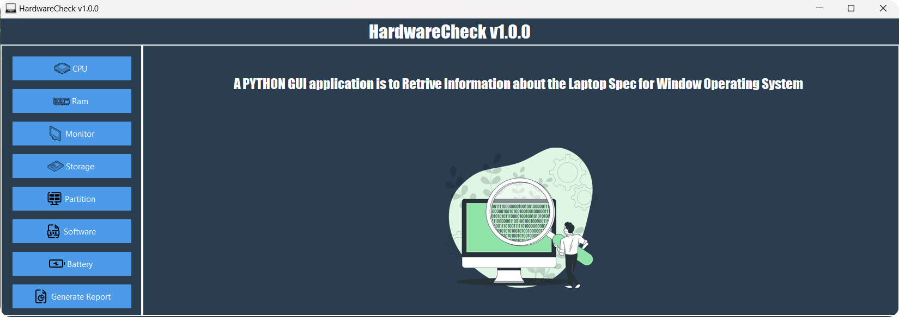

# HardwareCheck

## Overview

**HardwareCheck** is a Windows application that retrieves and displays detailed information about the hardware components of a laptop, including the CPU,RAM, and storage,Battery and other use full Informations. This tool provides a user-friendly graphical interface to view this information.

## Features

- Retrieve detailed information about CPU, GPU, RAM, and storage.
- Display system information in a graphical interface.
- Available as a standalone executable (`.exe`) for Windows.

## Installation

### Download the Executable

1. **Download the Executable:**

   - Download the latest version from the [releases page](https://github.com/Hacker-SriDhar/HardwareCheck/releases).

2. **Run the Executable:**

   - Double-click the downloaded `.exe` file to launch the application.

## Usage

1. **Launch the Application:**
   - Double-click the `.exe` file to start the application.

2. **View Hardware Information:**
   - Use the graphical interface to navigate and view details about different hardware components.

## License

This project is licensed under the MIT License - see the [LICENSE](LICENSE) file for details.

## Author

[Hacker-SriDhar](https://github.com/Hacker-SriDhar)

## Acknowledgments

- Thanks to the contributors of the Python libraries used in this project.
- Inspired by the need for an accessible hardware information tool for Windows.

## Contact

For any questions or feedback, please reach out to [sridharthehacker@gmail.com](mailto:sridharthehacker@gmail.com).
